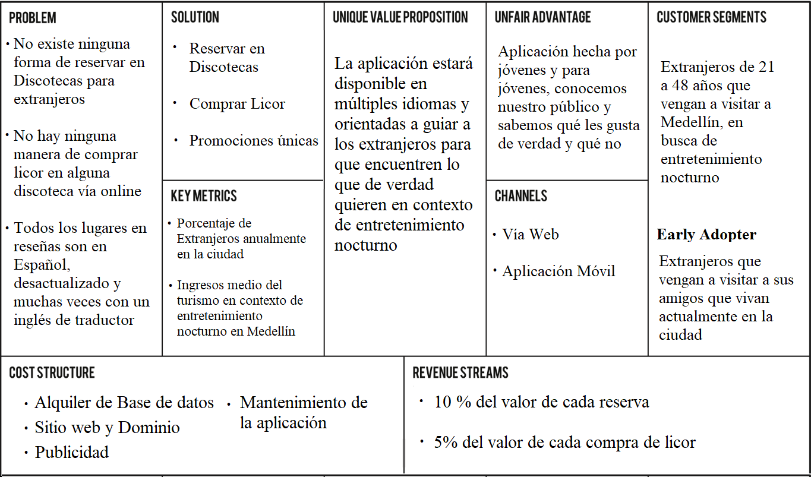

# DiscoTech

## 2. Tema
Se trata de la creación de una aplicación en donde se pueda interactuar con los mejores sitios de entretenimiento de la ciudad de Medellín; Bares, discotecas, restaurantes, todos estos lugares en donde podamos reservar, ver sus eventos, promociones, comprar licor y ubicarlos vía GPS para poder asistir a estos.

## 3. Planteamiento del problema
Uno de los mayores problemas se presentan al asistir a lugares de entretenimiento  fue ver el gran número de extranjeros que estaban ansiosos por asistir a alguna discoteca pero no sabían para dónde ir, por dónde empezar, aún así, existen tours que dicen ser los mejores para conocer la noche de Medellín pero están organizados por empresarios, personas que no saben de verdad dónde están los verdaderos sitios de entretenimiento porque no los viven, solo piensan en los extranjeros como un producto o cliente y no como personas que quieren disfrutar de verdad cada género, cada sensación y cada subcultura de Colombia. Por tanto, el mayor problema es el desconocimiento y la mal información que se les da a estas personas acerca de el contexto de entretenimiento nocturno de Medellín y de Colombia en general.

## 4. Justificación
Esta aplicación es hecha no solo con el fin de agrupar las mejores discotecas de Medellín, sino el de culturizar y dar a luz las múltiples subculturas que hay en Colombia, el de informar al mundo entero que no solo somos un lugar latino, sino que también tenemos cumbia, vallenato, reggaetón; Que tenemos una subcultura muy importante de electrónica y que no nos quedamos atrás en ninguna escena de rock, no solo somos reggaetón y vallenato, no solo somos guaracha y salsa, en Colombia somos un mundo muy extenso.

## 5. Estado del Arte
En este momento la única aplicación que existe y es parecida a nuestro proyecto se llama EventSite, una aplicación en donde puedes ver los eventos y reservar, sin embargo, esta aplicación es solo para nacionales, no existe una introducción o guía para extranjeros, tampoco está en inglés o algún otro idioma, solo en español. Otra aplicación o página web es TripAdvisor, pero esta página está demasiado desactualizada, sus reviews son de 2010, como máximo 2016, en donde muchas discotecas ya ni siquiera existen. 

Nuestro proyecto es en este momento único en el mercado, no hay ninguna aplicación en donde puedas reservar una discoteca a tiempo real, comprar licor, recibir promociones únicas, entre otros múltiples beneficios, planeamos que esté en diversos lenguajes, algunos como Español, Inglés, Alemán, Portugués, Francés, entre muchos otros.

## 6. Objetivo General
Llegar a una concientización social en donde se de a conocer las verdaderas raíces, culturas y sensaciones que tiene Medellín a nivel de entretenimiento.

## 7. Objetivos Específicos
Habilitar opciones de reserva para discotecas en donde se filtre o categorice por género, cultura, idiomas, sensaciones, entre muchas otras opciones.

Promocionar para culturizar y no para ganar dinero porque sí, introducir al mundo del entretenimiento de Medellín una nueva tecnología que haga más fácil vivir cada experiencia de cada lugar de rumba nocturna de la ciudad.

## 8. Modelo de Negocio
